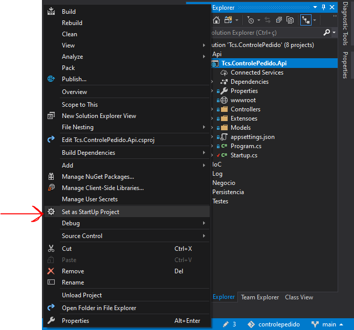
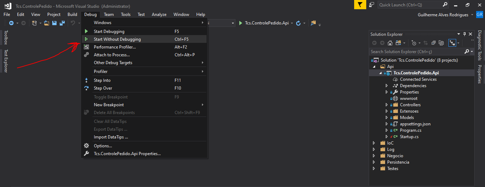
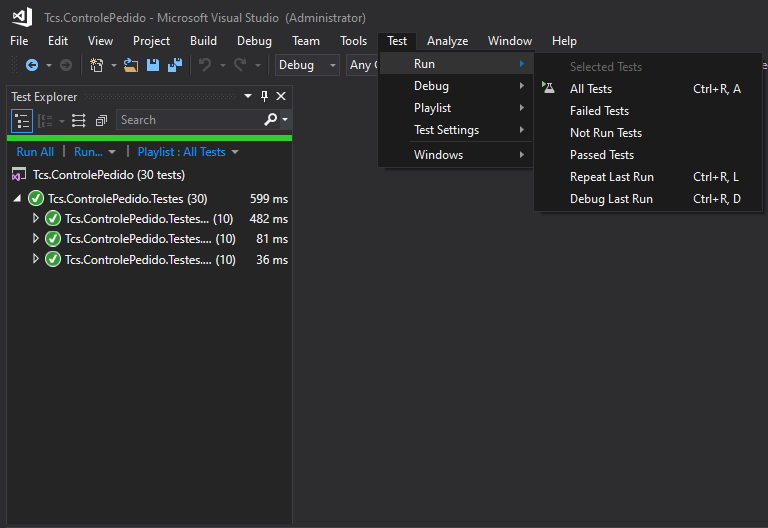

Instruções
============

## Compilação e Execução

  1. Abrir a solution `Tcs.ControlePedido.sln` com o Visual Studio (qualquer versão).
  2. Abrir a janela Solution Explorer (*View -> Solution Explorer*)
  3. Selecionar o projeto `Tcs.ControlePedido.Api` como o projeto de inicialização.
  
  4. Inicializar o projeto sem *debugging*.
  
  5. Abrir o browser no endereço <https://localhost:5001/swagger/index.html>

## Execução dos testes unitários

  1. Na barra de ferramentas principal, seguir o caminho *Test -> Run -> All Tests*
  
  2. Para visualizar o resultado da execução, seguir o caminho *Test -> Windows -> Test Explorer*
  